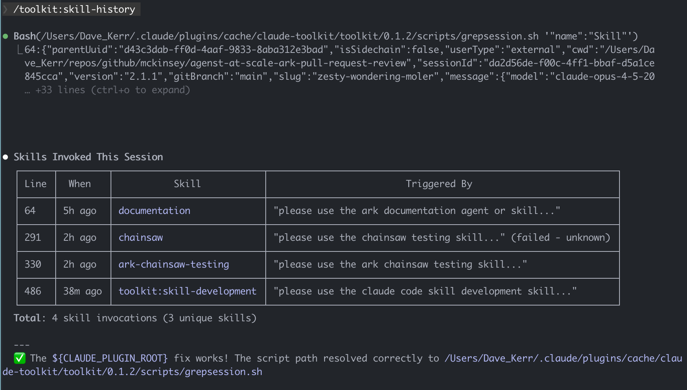
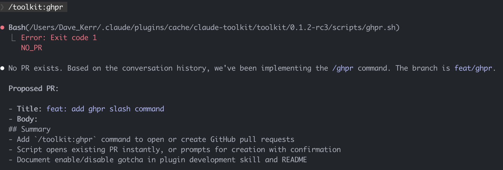
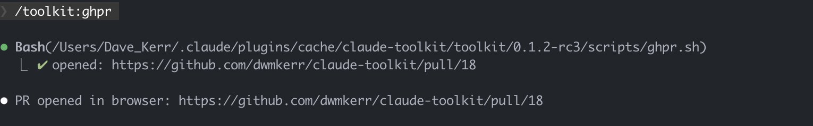
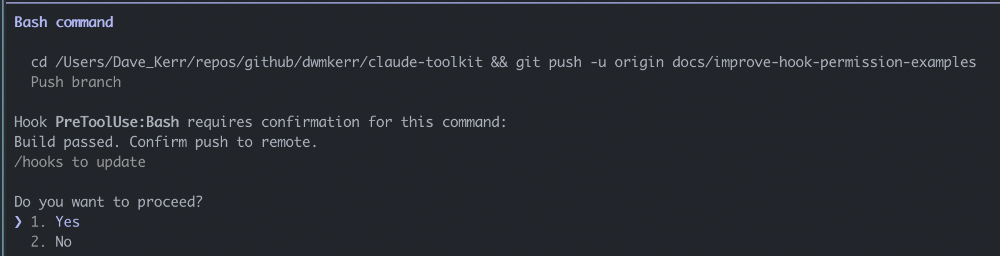
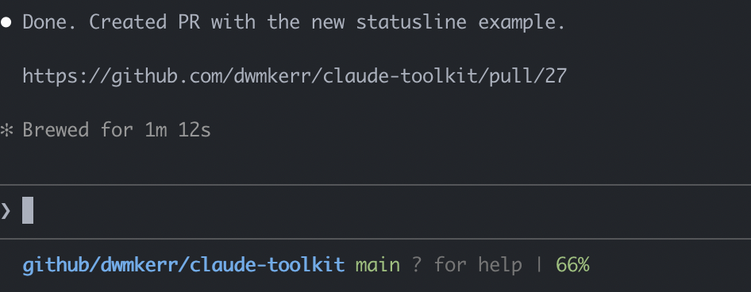
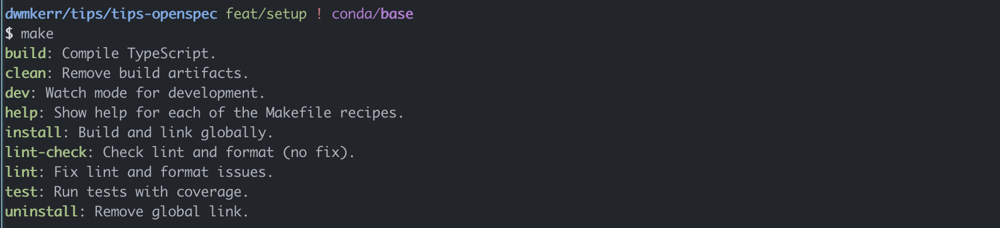

# claude-toolkit

[](https://github.com/dwmkerr/claude-toolkit/actions/workflows/skill-tests.yaml)

General purpose Claude Code `toolkit` plugin for skill/hook/agent development, research, skill analysis, Github quality of life and more.

## Quickstart

Add the marketplace and install:

```
/plugin marketplace add dwmkerr/claude-toolkit
/plugin install toolkit@claude-toolkit
```

If commands don't appear, enable and restart:

```
/plugin enable toolkit@claude-toolkit

# Or bust the cache in a terminal if stuff's still not loading...
# rm -rf ~/.claude/plugins/cache
```

<!-- vim-markdown-toc GFM -->

- [The `toolkit` Plugin](#the-toolkit-plugin)
    - [Commands](#commands)
        - [`/toolkit:skill-history`](#toolkitskill-history)
        - [`/toolkit:agent-history`](#toolkitagent-history)
        - [`/toolkit:ghpr`](#toolkitghpr)
    - [Skills](#skills)
        - [`research`](#research)
        - [`claude-code-hook-development`](#claude-code-hook-development)
        - [`skill-development`](#skill-development)
        - [`agent-development`](#agent-development)
        - [`claude-code-slash-commands`](#claude-code-slash-commands)
        - [`claude-code-statusline-development`](#claude-code-statusline-development)
        - [`anthropic-evaluations`](#anthropic-evaluations)
        - [`shell-script-development`](#shell-script-development)
        - [`makefile-development`](#makefile-development)
        - [`release-please-development`](#release-please-development)
        - [`claude-code-plugin-development`](#claude-code-plugin-development)
        - [`learn-and-improve`](#learn-and-improve)
    - [Agents](#agents)
        - [`researcher`](#researcher)
- [The `dwmkerr` Plugin](#the-dwmkerr-plugin)
    - [Skills](#skills-1)
        - [`my-repos`](#my-repos)
        - [`project-setup`](#project-setup)
- [Developer Guide](#developer-guide)
    - [Local Development](#local-development)
- [Further Reading](#further-reading)
- [License](#license)

<!-- vim-markdown-toc -->

## The `toolkit` Plugin

This plugin is general purpose and should be useful for anyone.

### Commands

#### `/toolkit:skill-history`

This is useful for troubleshooting whether Claude has actually invoked or missed skills, and in response to what queries.



See [skill history examples](./docs/examples/skill-history).

#### `/toolkit:agent-history`

> What agents have been spawned?

- Searches session log for agent spawns
- Shows timestamp, agent name, and task

#### `/toolkit:ghpr`

> Open or create a pull request for my current branch

- Opens existing PR in browser if one exists
- Creates new PR with confirmation if none exists
- Infers PR type from branch name (`feat/`, `fix/`, `chore/`, etc.)
- Checks for relevant project skills for conventions

Example, when no PR exists:



And when it does. The browser opens automatically:



### Skills

#### `research`

> Research options for implementing OAuth in a Node.js app

- Searches web and clones GitHub repos
- Requires 2-3 sources before recommending
- Saves findings to `./scratch/research/`

#### `claude-code-hook-development`

> Create a hook that runs tests before git push and requires explicit
> confirmation before pushing to remote.

- Creates shell scripts in `.claude/hooks/`
- Configures hook events in `.claude/settings.json`
- Supports blocking (exit 2) and non-blocking hooks

Example output 



See [github.com/dwmkerr/effective-shell](https://github.com/dwmkerr/effective-shell) for some real-world examples (or most of my recently edited open source projects).

#### `skill-development`

> Create a skill for TypeScript development

- Creates `SKILL.md` with frontmatter
- Organizes references in subdirectories
- Follows progressive disclosure pattern
- Incorporates best practices from [The Complete Guide to Building Skills for Claude](https://resources.anthropic.com/hubfs/The-Complete-Guide-to-Building-Skill-for-Claude.pdf) — covering skill categories, reusable patterns, testing strategies, and troubleshooting

#### `agent-development`

> Create an agent for code review

- Creates agent markdown with YAML frontmatter
- Applies color conventions (blue=plan, green=create, etc.)
- Configures tools and permissions

#### `claude-code-slash-commands`

> Create a slash command for generating changelogs

- Creates command markdown in `.claude/commands/`
- Configures frontmatter (allowed-tools, argument-hint)
- Supports `$ARGUMENTS` and positional `$1`, `$2` params

#### `claude-code-statusline-development`

> Create a custom statusline showing git branch and context usage

- Creates shell scripts for `statusLine` in `.claude/settings.json`
- Provides JSON schema reference for session data
- Examples for git info, context percentage, cost tracking

After running this example, you'll have a statusline similar to the below:



#### `anthropic-evaluations`

> Create an evaluation suite for my coding agent

- Defines grader types (code-based, model-based, human)
- Patterns for coding, conversational, research, and computer use agents
- YAML templates for eval tasks
- Roadmap for building evals from scratch

#### `shell-script-development`

> Create a bash script for deployment

- Consistent shebang and safety options
- Color output conventions
- Status message patterns (success, error, warning)

#### `makefile-development`

> Create a Makefile for my project

- Self-documenting help target with colour-coded output
- Consistent conventions for `.PHONY`, target naming, and comments
- Script delegation pattern for complex logic



#### `release-please-development`

> Set up release-please for automated versioning

- Single package pattern for simple repos
- Multi-package pattern for monorepos with independent versions
- Configuration for Helm charts, npm packages, and more
- GitHub workflow with conditional jobs per package

#### `claude-code-plugin-development`

> Create a plugin that bundles my hooks and commands

- Creates plugin structure with `.claude-plugin/plugin.json`
- Bundles commands, agents, skills, hooks, MCP/LSP servers
- CLI commands for install, enable, disable, update
- Debugging guide with `claude --debug`

#### `learn-and-improve`

> That skill kept asking for permissions — fix my setup so it doesn't happen again

- Analyzes conversation history for friction (permission prompts, missed skills, agent failures)
- Searches settings, CLAUDE.md, plugins, hooks, and MCP config
- Proposes targeted fixes at the right scope (user, project, or local)
- Supports permission rules, CLAUDE.md entries, skill/agent tweaks, hook config, and plugin PRs
- **Self-improving** — every verified fix is recorded back into the skill as an example, so it gets better at diagnosing similar problems over time. Fork the plugin to accumulate your own improvement history

### Agents

#### `researcher`

> Research how to implement terminal recording in an MCP server

- Searches web for documentation and repos
- Clones GitHub repos to `/tmp` for examination
- Presents options with pros/cons and sources

## The `dwmkerr` Plugin

Opinionated plugin with my personal workflows and conventions. You're welcome to use it or fork it, but it's built around how I work — paths, repo structure, tool preferences. If something looks useful, steal the pattern and adapt it.

```
/plugin install dwmkerr@claude-toolkit
```

### Skills

#### `my-repos`

> Check my repo effective-shell for the pipes chapter

- Locates repos in `~/repos/github/dwmkerr/` or `~/repos/github/mckinsey/`
- Checks local first, stashes changes if needed for branch switching
- Uses `gh` CLI to find remote repos if not local
- Clones missing repos to the standard location

#### `project-setup`

> Create a new project called config-validator

- Creates private GitHub repo with description
- Configures squash merges only, branch protection
- Enables GitHub Actions to create PRs
- Adds MIT license and basic README

This skill runs as a subagent (`context: fork`) as only the final output is needed for the current agent.


## Developer Guide

### Local Development

Clone and install from local source:

```bash
git clone https://github.com/dwmkerr/claude-toolkit.git
cd claude-toolkit
claude plugin marketplace add ./
claude plugin install toolkit@claude-toolkit
```

If you change the files, bump the version with `make bump`, bust the cache and reinstall then re-open Claude. There might be a cleaner way but this seems to work consistently:
Bust the cache and reinstall:

```bash
make bump
rm -rf ~/.claude/plugins/cache/claude-toolkit && claude plugin install toolkit@claude-toolkit
```

Uninstall with:

```bash
claude plugin marketplace remove claude-toolkit
```


## Further Reading

- [claude-code-showcase](https://github.com/ChrisWiles/claude-code-showcase) - Comprehensive showcase of Claude Code configuration patterns including skill evaluation hooks, GitHub Actions workflows, and ticket management integrations

## License

MIT
