# claude-toolkit

Skills for problem sovling, software engineering, slide creation, agent development, quality of life and more. Also available at https://www.skills.sh/dwmkerr/claude-toolkit.

## Quickstart

Add the marketplace and install:

```
/plugin marketplace add dwmkerr/claude-toolkit
/plugin install toolkit@claude-toolkit
```

If commands don't appear, enable and restart:

```
/plugin enable toolkit@claude-toolkit

# Or bust the cache in a terminal if stuff's still not loading...
# rm -rf ~/.claude/plugins/cache
```

## Install via `npx skills`

The skills also install without the plugin via [`npx skills`](https://github.com/vercel-labs/skills) (or [`openskills`](https://github.com/numman-ali/openskills)), which copies `SKILL.md` folders into `.claude/skills/` and works with Claude Code, Cursor, Codex, and other agents:

```bash
npx skills add dwmkerr/claude-toolkit                        # all skills
npx skills add dwmkerr/claude-toolkit --skill solve-problem  # a single skill
```

> Note: this installs **all** skills, including the personal `dwmkerr` ones (`my-repos`, `project-setup`, `slides`, `drawio-diagram`). Use `--skill <name>` to pick only what you want.

<!-- vim-markdown-toc GFM -->

- [The `toolkit` Plugin](#the-toolkit-plugin)
    - [Commands](#commands)
        - [`/toolkit:agent-history`](#toolkitagent-history)
        - [`/toolkit:ghpr`](#toolkitghpr)
        - [`/toolkit:skill-history`](#toolkitskill-history)
    - [Skills](#skills)
        - [`agent-development`](#agent-development)
        - [`anthropic-evaluations`](#anthropic-evaluations)
        - [`claude-code-agent-teams`](#claude-code-agent-teams)
        - [`claude-code-hook-development`](#claude-code-hook-development)
        - [`claude-code-memory-and-rules`](#claude-code-memory-and-rules)
        - [`claude-code-plugin-development`](#claude-code-plugin-development)
        - [`claude-code-skill-development`](#claude-code-skill-development)
        - [`claude-code-slash-commands`](#claude-code-slash-commands)
        - [`claude-code-statusline-development`](#claude-code-statusline-development)
        - [`learn-and-improve`](#learn-and-improve)
        - [`makefile-development`](#makefile-development)
        - [`release-please-development`](#release-please-development)
        - [`research`](#research)
        - [`shell-script-development`](#shell-script-development)
        - [`solve-problem`](#solve-problem)
    - [Agents](#agents)
        - [`researcher`](#researcher)
- [The `dwmkerr` Plugin](#the-dwmkerr-plugin)
    - [Commands](#commands-1)
        - [`/dwmkerr:next`](#dwmkerrnext)
    - [Skills](#skills-1)
        - [`drawio-diagram`](#drawio-diagram)
        - [`my-repos`](#my-repos)
        - [`project-setup`](#project-setup)
        - [`slides`](#slides)
- [Developer Guide](#developer-guide)
    - [Local Development](#local-development)
- [Further Reading](#further-reading)
- [License](#license)

<!-- vim-markdown-toc -->

## The `toolkit` Plugin

This plugin is general purpose and should be useful for anyone.

### Commands

#### `/toolkit:agent-history`

> What agents have been spawned?

- Searches session log for agent spawns
- Shows timestamp, agent name, and task

#### `/toolkit:ghpr`

> Open or create a pull request for my current branch

- Opens existing PR in browser if one exists
- Creates new PR with confirmation if none exists
- Infers PR type from branch name (`feat/`, `fix/`, `chore/`, etc.)
- Checks for relevant project skills for conventions

Example, when no PR exists:

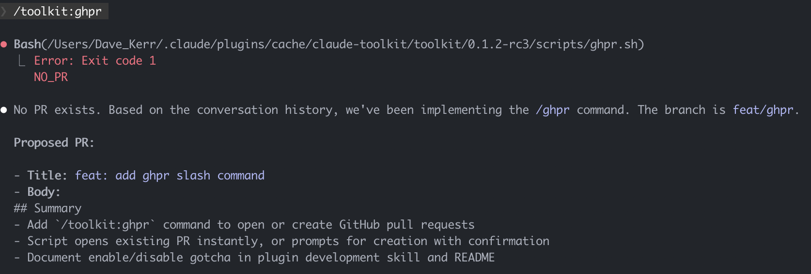

And when it does. The browser opens automatically:

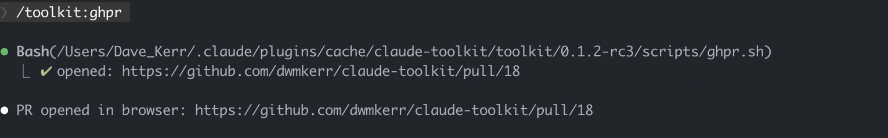

#### `/toolkit:skill-history`

This is useful for troubleshooting whether Claude has actually invoked or missed skills, and in response to what queries.

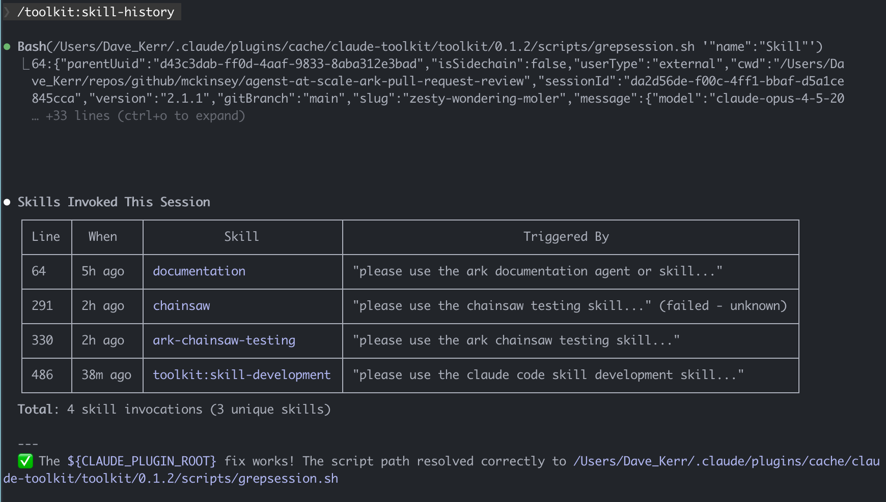

See [skill history examples](./docs/examples/skill-history).

### Skills

#### `agent-development`

> Create an agent for code review

- Creates agent markdown with YAML frontmatter
- Applies color conventions (blue=plan, green=create, etc.)
- Configures tools and permissions

#### `anthropic-evaluations`

> Create an evaluation suite for my coding agent

- Defines grader types (code-based, model-based, human)
- Patterns for coding, conversational, research, and computer use agents
- YAML templates for eval tasks
- Roadmap for building evals from scratch

#### `claude-code-agent-teams`

> Create an agent team to review this PR from three different angles

- Coordinates multiple Claude Code instances as a team with shared tasks and messaging
- Covers team creation, display modes (in-process vs split panes), task assignment, and cleanup
- Includes decision guide for agent teams vs subagents
- Best practices for team sizing, task sizing, and avoiding file conflicts

#### `claude-code-hook-development`

> Create a hook that runs tests before git push and requires explicit
> confirmation before pushing to remote.

- Creates shell scripts in `.claude/hooks/`
- Configures hook events in `.claude/settings.json`
- Supports blocking (exit 2) and non-blocking hooks

Example output

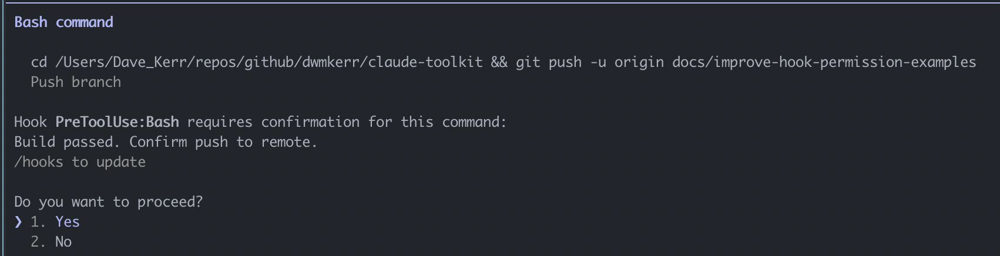

See [github.com/dwmkerr/effective-shell](https://github.com/dwmkerr/effective-shell) for some real-world examples (or most of my recently edited open source projects).

#### `claude-code-memory-and-rules`

> Set up CLAUDE.md and rules for my project

- Configures CLAUDE.md files, `.claude/rules/`, and auto memory
- Guides scope selection (user, project, local, org)
- Supports path-scoped rules for file-type-specific conventions
- Covers imports, bootstrapping with `/init`, and the `/memory` command
- Includes rules vs hooks decision guide

#### `claude-code-plugin-development`

> Create a plugin that bundles my hooks and commands

- Creates plugin structure with `.claude-plugin/plugin.json`
- Bundles commands, agents, skills, hooks, MCP/LSP servers
- CLI commands for install, enable, disable, update
- Debugging guide with `claude --debug`

#### `claude-code-skill-development`

> Create a skill for TypeScript development

- Creates `SKILL.md` with frontmatter
- Organizes references in subdirectories
- Follows progressive disclosure pattern
- Incorporates best practices from [The Complete Guide to Building Skills for Claude](https://resources.anthropic.com/hubfs/The-Complete-Guide-to-Building-Skill-for-Claude.pdf) — covering skill categories, reusable patterns, testing strategies, and troubleshooting

#### `claude-code-slash-commands`

> Create a slash command for generating changelogs

- Creates command markdown in `.claude/commands/`
- Configures frontmatter (allowed-tools, argument-hint)
- Supports `$ARGUMENTS` and positional `$1`, `$2` params

#### `claude-code-statusline-development`

> Create a custom statusline showing git branch and context usage

- Creates shell scripts for `statusLine` in `.claude/settings.json`
- Provides JSON schema reference for session data
- Examples for git info, context percentage, cost tracking

After running this example, you'll have a statusline similar to the below:

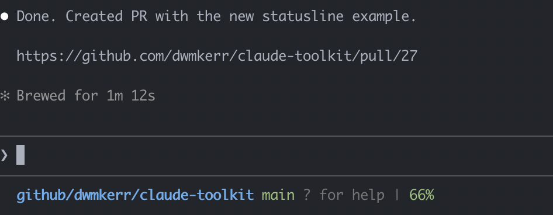

#### `learn-and-improve`

> That skill kept asking for permissions — fix my setup so it doesn't happen again

- Analyzes conversation history for friction (permission prompts, missed skills, agent failures)
- Searches settings, CLAUDE.md, plugins, hooks, and MCP config
- Proposes targeted fixes at the right scope (user, project, or local)
- Proactively suggests permanently allowing safe read-only commands observed in the session (e.g., `ls`, `gh pr view`, `git log`) at user level
- Supports permission rules, CLAUDE.md entries, skill/agent tweaks, hook config, and plugin PRs
- **Self-improving** — every verified fix is recorded back into the skill as an example, so it gets better at diagnosing similar problems over time. Fork the plugin to accumulate your own improvement history

#### `makefile-development`

> Create a Makefile for my project

- Self-documenting help target with colour-coded output
- Consistent conventions for `.PHONY`, target naming, and comments
- Script delegation pattern for complex logic

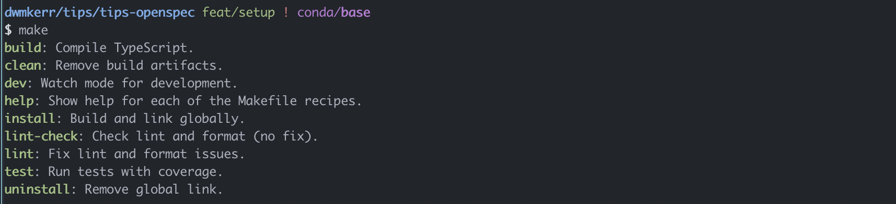

#### `release-please-development`

> Set up release-please for automated versioning

- Single package pattern for simple repos
- Multi-package pattern for monorepos with independent versions
- Configuration for Helm charts, npm packages, and more
- GitHub workflow with conditional jobs per package

#### `research`

> Use the research skill to investigate options for implementing OAuth in a Node.js app

- Searches web and clones GitHub repos
- Requires 2-3 sources before recommending
- Saves findings to `./scratch/research/`

**Tip:** "research" is a generic term — Claude may use built-in tools (Explore, WebFetch) instead of this skill. Be explicit: say "use the research skill" or "use the researcher agent" to ensure the structured research workflow is triggered.

#### `shell-script-development`

> Create a bash script for deployment

- Consistent shebang and safety options
- Color output conventions
- Status message patterns (success, error, warning)

#### `solve-problem`

> solve problem: the burnup chart doesn't render

- Methodical, evidence-first problem solving — resists jumping to the first plausible fix
- Six moves: understand intent, observe the problem first-hand, form multiple hypotheses, gather discriminating evidence, propose, verify the resolution
- Domain-neutral — works for code bugs, broken appliances, dropped sales, failing processes
- Shows its full working (problem, evidence, hypotheses, root cause, confidence) so you can debug the reasoning
- Invoke explicitly with "solve problem" or `/solve-problem`

### Agents

#### `researcher`

> Research how to implement terminal recording in an MCP server

- Searches web for documentation and repos
- Clones GitHub repos to `/tmp` for examination
- Presents options with pros/cons and sources

## The `dwmkerr` Plugin

Opinionated plugin with my personal workflows and conventions. You're welcome to use it or fork it, but it's built around how I work — paths, repo structure, tool preferences. If something looks useful, steal the pattern and adapt it.

```
/plugin install dwmkerr@claude-toolkit
```

### Commands

#### `/dwmkerr:next`

> What should I work on next?

- Surveys current branch, commits, working tree, tasks.md, ideas.md, and open GitHub issues
- Detects development frameworks (Obra Superpowers, OpenSpec) and includes active plan steps
- Presents up to 5 prioritized next actions with source tags
- With arguments like "done" or "finished", switches to wrap-up mode: summarizes session, offers to create PR, update tasks/ideas

### Skills

#### `drawio-diagram`

> Create a drawio architecture diagram of this system

- Generates `.drawio` files with consistent visual style (color-coded element types, orthogonal edges, legend)
- Element types: Container (blue), Capability (green), External (grey), Tech Preview (purple), Process (orange), Use Case (yellow), Outcome (dark green)
- Exports to PNG/SVG/PDF via draw.io CLI
- Self-contained HTML export for sharing without draw.io installed

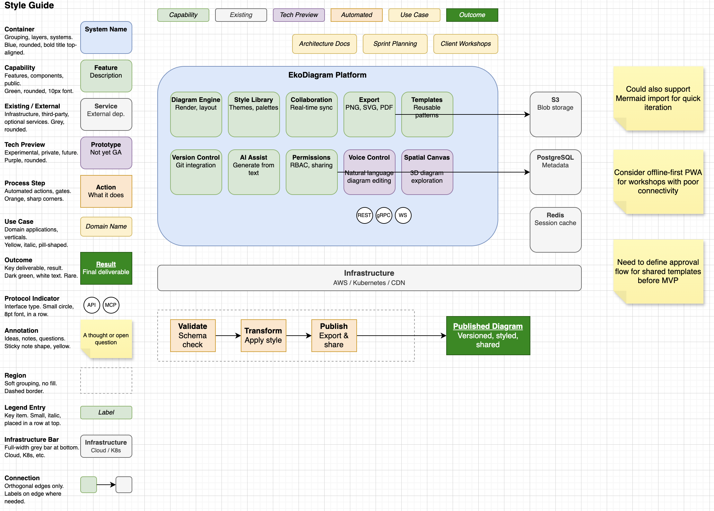

#### `my-repos`

> Check my repo effective-shell for the pipes chapter

- Locates repos in `~/repos/github/dwmkerr/` or `~/repos/github/mckinsey/`
- Checks local first, stashes changes if needed for branch switching
- Uses `gh` CLI to find remote repos if not local
- Clones missing repos to the standard location

#### `project-setup`

> Create a new project called config-validator

- Creates private GitHub repo with description
- Configures squash merges only, branch protection
- Enables GitHub Actions to create PRs
- Adds MIT license and basic README

This skill runs as a subagent (`context: fork`) as only the final output is needed for the current agent.

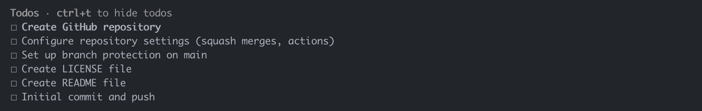

#### `slides`

> Create slides for this project

- **Slidev mode (default)** — scaffolds a [Slidev](https://sli.dev) markdown deck in `./slides/`, generating title and content slides from the README or a prompt, with `Makefile` targets for dev server, build, and PDF export
- **Conference mode** — hand-built HTML deck with no framework or build step: dark typographic theme, right-arrow progressive reveal, in-deck speaker notes, a phone teleprompter sheet, and GitHub Pages deploy
- Supports custom Slidev themes (includes `qblabs`, inspired by QuantumBlack's public visual identity)

Conference mode — from my [AI Native DevCon London 2026 talk](https://www.youtube.com/watch?v=ACL7_EsfIio) ([blog post](https://dwmkerr.com/bipolar-dysregulation-and-ai/)). The final deck is bundled as a readable example: [`conference-example.html`](./plugins/dwmkerr/skills/slides/references/conference-example.html).

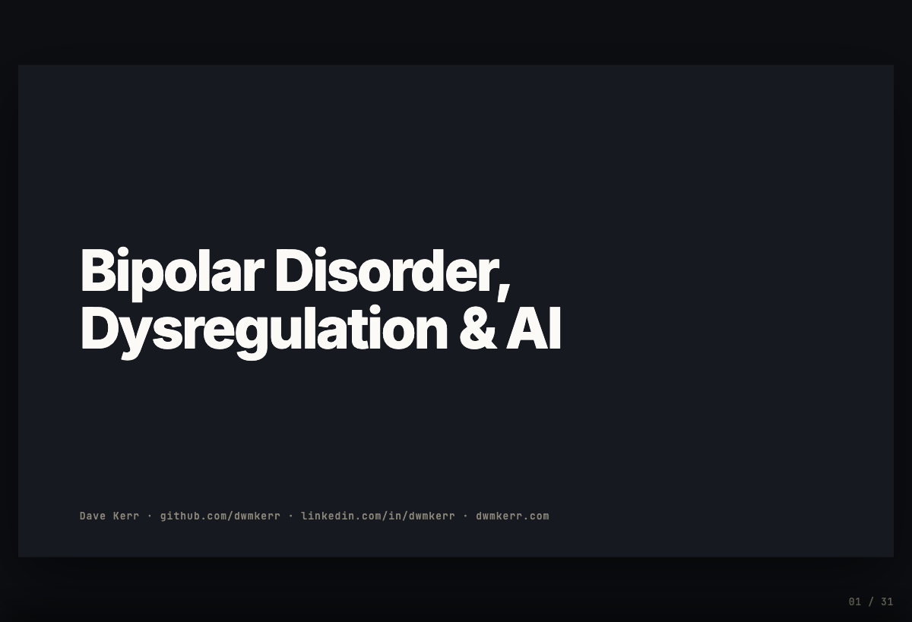

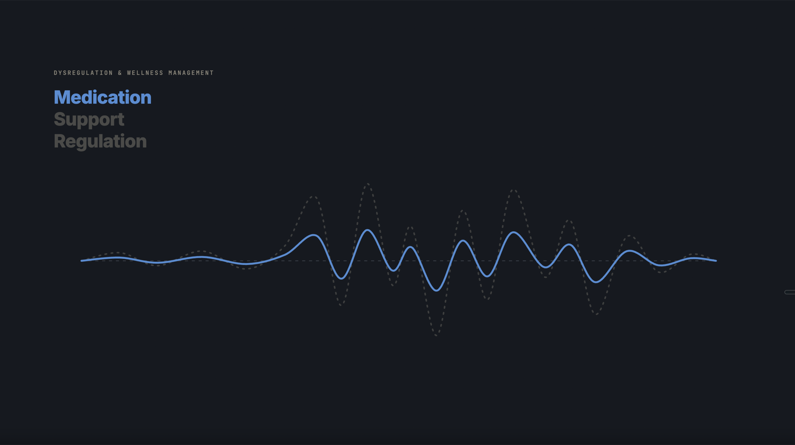

`qblabs` theme:

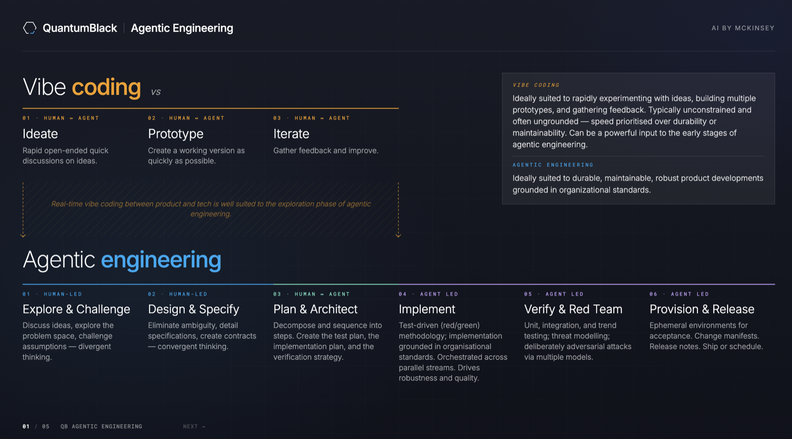

> The `qblabs` theme is an approximation inspired by QuantumBlack's publicly available visual identity — not an official brand guide. The source deck is internal, so only this single slide is shown (bundled as [`qblabs-example-slide.html`](./plugins/dwmkerr/skills/slides/references/qblabs-example-slide.html)). See [the theme's attribution notes](./plugins/dwmkerr/skills/slides/themes/qblabs/README.md) for sources.

## Developer Guide

### Local Development

Clone and install from local source:

```bash
git clone https://github.com/dwmkerr/claude-toolkit.git
cd claude-toolkit
claude plugin marketplace add ./
claude plugin install toolkit@claude-toolkit
```

If you change the files, bump the version with `make bump`, bust the cache and reinstall then re-open Claude. There might be a cleaner way but this seems to work consistently:
Bust the cache and reinstall:

```bash
make bump
rm -rf ~/.claude/plugins/cache/claude-toolkit && claude plugin install toolkit@claude-toolkit
```

Uninstall with:

```bash
claude plugin marketplace remove claude-toolkit
```


## Further Reading

- [claude-code-showcase](https://github.com/ChrisWiles/claude-code-showcase) - Comprehensive showcase of Claude Code configuration patterns including skill evaluation hooks, GitHub Actions workflows, and ticket management integrations

## License

MIT
