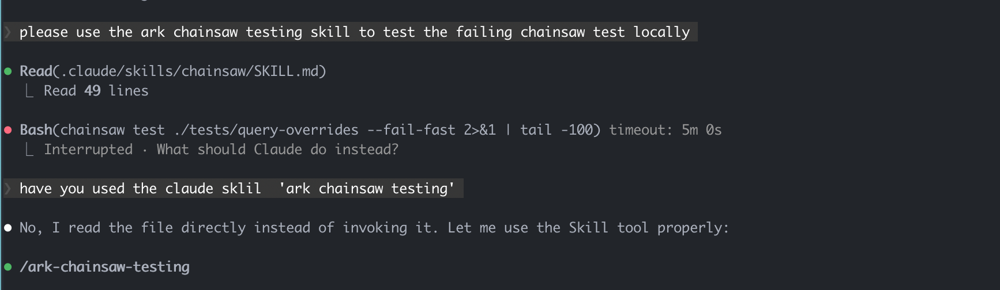

# Skill History

Track which skills Claude invokes during a session.

## The Problem

Claude sometimes misses skills or invokes unexpected ones. Without visibility, debugging is difficult:



## The Solution

Use `/toolkit:skill-history` to see exactly what skills were invoked:


## Usage

```
/toolkit:skill-history
```

This searches the session log and displays:
- Timestamp of each skill invocation
- Skill name
- What triggered it

## How It Works

The command uses `grepsession.sh` to efficiently search the session JSONL file for skill invocations, avoiding the need to load the entire (often large) session file.

## See Also

- `/toolkit:agent-history` - Track agent spawns
